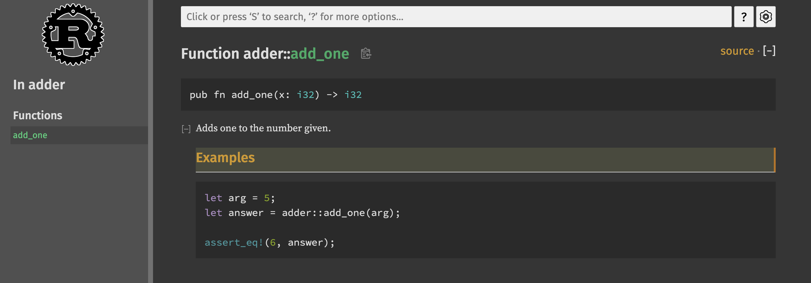
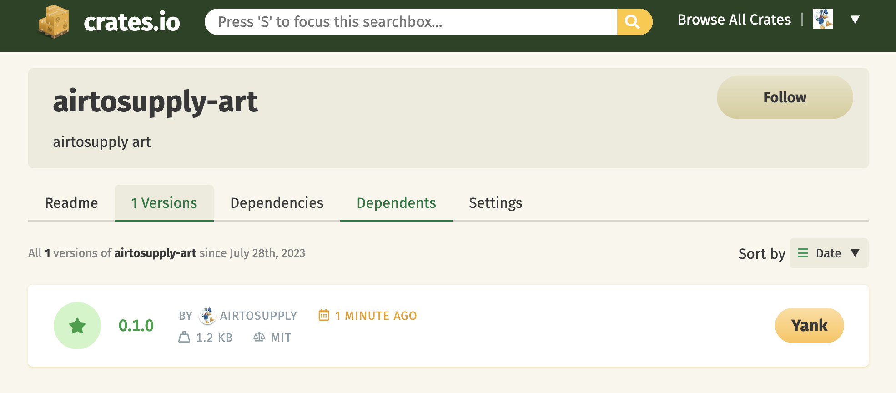

# 发布配置

​		在Rust中Cargo有两个主要的配置和构建方式，分别如下：

​		1⃣️ **dev**：该配置被定义为开发时的默认配置，通过如下命令进行构建：

```shell
cargo build
```

​		2⃣️ **release**：该配置是具有良好的发布构建的默认配置，通过如下命令进行构建：

```shell
cargo build --release
```

# 自定义发布配置

​		在每个工程项目中的Cargo.toml可以自定义发布配置选项，例如下面的配置：

```toml
[profile.dev]
opt-level = 0

[profile.release]
opt-level = 3
```

​		一般而言，默认情况下如果没有显式增加任何[profile.*]配置时，Cargo会对每一个配置都采用默认设置；反正则会覆盖默认配置。

​		**opt-level**参数会设置控制Rust会对代码进行何种程度的优化。这个配置的值从数字0到数字3，数字越大表示越高的优化级别，也就需要更多的时间编译。默认情况下：

​		1⃣️ 发布配置为dev的opt-level参数默认为0；

​		2⃣️ 发布配置为release的opt-level参数默认为3。

# 给crate编写有用的文档注释

​		准确的包文档有助于其他用户理解如何以及何时使用他们，所以花一些时间编写文档是值得的。在Rust中通过`//`注释Rust代码。

​		和普通注释所不同这里的`///`表示文档注释，并且支持markdown语法。例如下面[adder](./adder/src/lib.rs)这个例子：

```rust
/// Adds one to the number given.
///
/// # Examples
///
/// ```
/// let arg = 5;
/// let answer = my_crate::add_one(arg);
///
/// assert_eq!(6, answer);
/// ```
pub fn add_one(x: i32) -> i32 {
    x + 1
}
```

​		通过如下命令可以自动生成本地文档：

```shell
cargo doc --open
```

​		Rust会构建当前crate文档（同时还有所有 crate 依赖的文档）的HTML并在本地浏览器中打开。类似如下图：




# 如何将crate发布到Crates.io

​		我们曾经在项目中使用[crates.io]([https://crates.io/])上的包作为依赖，例如：猜数字游戏中用到的随机库rand，不过也可以通过发布自己的包来向他人分享代码。例如：我们想发布[airtosupply-art](./airtosupply-art/src/)这个crate。

【步骤一】登陆[crates.io]([https://crates.io/])，点击右上角的【Log in with GitHub】，通过github账号登陆到Crates.io。

【步骤二】点击右上角头像点击【Account Settings】->【Profile】->【User Email】完成邮箱验证，完成验证之后【User Email】提示`Verified`表示验证邮箱成功。

【步骤三】点击右上角头像点击【Account Settings】->【API Tokens】->【New Token】->【Generate Token】此时会生成一个字符串作为token。

【步骤四】将步骤二的token通过cargo指令进行登陆：

```shell
cargo login <token>
```

​		提示`Login token for `crates.io` saved`字样代表登陆成功。

【步骤五】进入到airtosupply-art这个crate的家目录。执行如下指令：

```shell
cargo publish
```

​		上传之后可以在crates.io上，点击右上角【Dashboard】查看到上传的crate库。如下图：




# PS

​		有关cargo更加详细的使用可以参考：[Cargo Guide](https://doc.rust-lang.org/cargo/guide/#cargo-guide)

