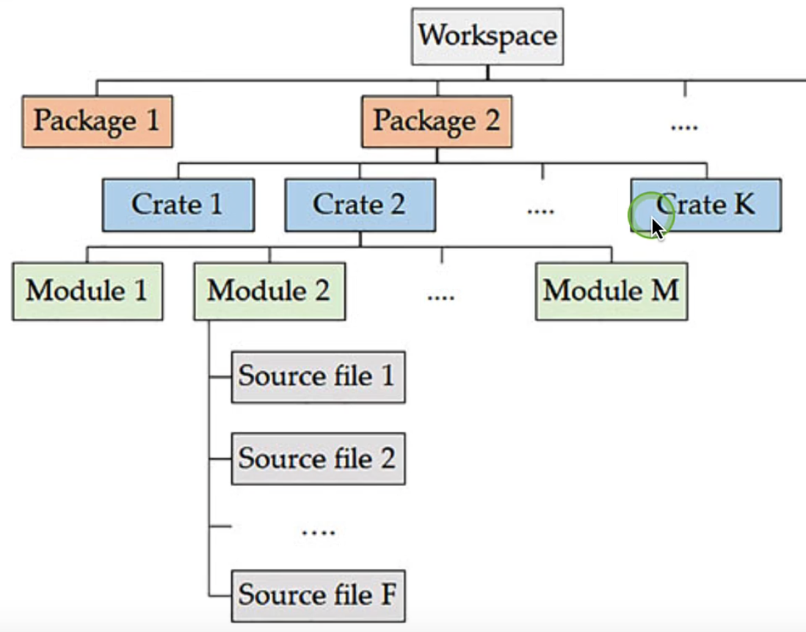

# 模块系统

## 如何理解模块系统？

​		在Rust中，模块系统大致如下图：



## 二进制crate	

​		当我们通过cargo指令去创建一个项目时，例如：

```shell
cargo new my-package
```

​		这代表我们创建一个名称为`my-package`的cargo项目，这个my-package也是包package的名称。

​		在Rust中如果一个包中的src目录下有一个**main.rs**文件，Rust就会自动生成一个和当前包同名的二进制crate，并且这个main.rs文件就是crate root。
​		**crate root**就是Rust编译器构建crate时的起始源文件，它也是这个crate的root module。
​		如果一个包中的src目录下有一个**lib.rs**文件，那么Rust就会自动生成一个和当前包同名的库crate，并且这个lib.rs也是库crate root。

​		可以在src下面创建一个子文件夹，比如src/bin，在子文件夹下面创建多个xxx.rs，如果xxx.rs文件中有main函数则为一个二进制crate。这样项目结构如下面这个样子：

```shell
<my-package>
  |- src
      |- bin
          |- another-one.rs  // 包含main函数 二进制crate
      |- main.rs             // 包含main函数 二进制crate
      |- lib.rs              //                库crate
  |- Cargo.toml
```

## 库crate

​		我们可以通过如下指令创建一个名称为restaurant的库crate：

```shell
cargo new --lib restaurant
```

​		默认会在名称为restaurant这个package下自动生成src/lib.rs文件。

​		在lib.rs定义如下代码：

```rust
mod front_of_house {
    mod hosting {
        fn add_to_waitlist() {}

        fn seat_at_table() {}
    }

    mod serving {
        fn take_order() {}

        fn serve_order() {}

        fn take_payment() {}
    }
}
```

​		在Rust的包中`src/main.rs` 和 `src/lib.rs` 叫做**crate根**。之所以这样叫它们是因为这两个文件的内容都分别在crate模块结构的根组成了一个名为 `crate` 的模块，该结构被称为 **模块树**（module tree）。所有如果用模块树的概念来理解crate中的模块如下：

```shell
crate                             // crate root
 └── front_of_house               // 父 mod
     ├── hosting                  // 子 mod
     │   ├── add_to_waitlist      // 函数
     │   └── seat_at_table        // 函数
     └── serving                  // 子 mod
         ├── take_order           // 函数
         ├── serve_order          // 函数
         └── take_payment         // 函数
```

​		具体项目可以参考：[restaurant](./restaurant/)

## crate规则

​       在包中crate必须遵守如下规则：

​		1⃣️ 一个包中至少包含一个crate。

​		2⃣️ 一个包中可以不包含库crate或者包含一个库crate。

​		3⃣️ 一个包中可以包含任意数量的二进制crate。		

# [路径访问方式](../modules/access-path/src/lib.rs)

## 1.绝对路径

## 2.相对路径

## 3.super关键的相对路径

# [访问修饰符](../modules/modifier/src/lib.rs)

## 1.结构体的访问修饰符

## 2.枚举的访问修饰符

# 总结

（1）Rust的模块系统概念包括：包（package）,包装箱（crate）,模块（module）和路径（path）；模块系统概的目的是用于有效的组织代码。

（2）crate是Rust中的一个编译单元，它可以是一个二进制crate，也可以是一个库crate。

（3）`cargo new`缺省创建的是二进制下项目，也可以通过命令`cargo new --bin`指定创建二进制项目，或者通过命令`cargo new --lib`指定创建库项目。

（4）一个包package可以由一个或者多个crate组成。它包含一个Cargo.toml文件，其中可以定义它所包含的多个crate。

（5）一个包最多只能由一个库crate，可以有任意多个二进制crate。但是一个包中必须至少有一个crate。

（6）模块类似名字空间，可以逻辑拆分和组织代码。模块用关键字`mod`定义，模块可以是public也可以是private的。

（7）缺省情况下，模块是private私有的，可以添加`pub`关键字，将一个模块设置为public的。模块中可以嵌套子模块。

（8）路径path用于访问一个模块中的定义的项，路径可以是相对，也可以是绝对的。


