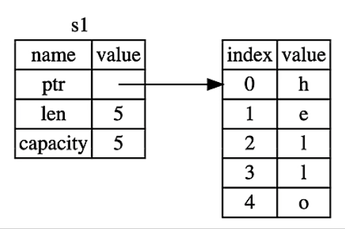
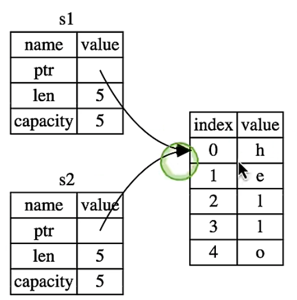
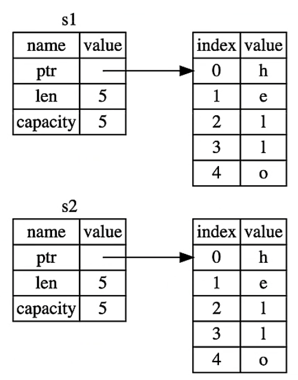
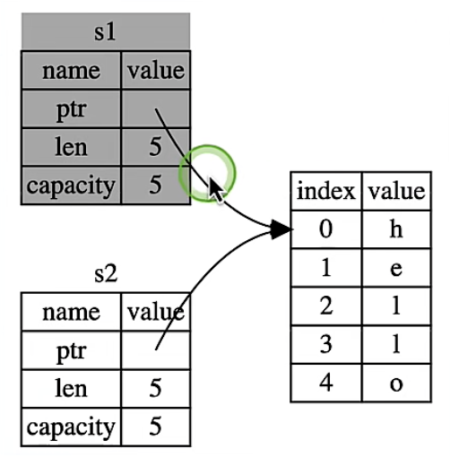

# Rust中的所有权规则

1. Rust中的每一个值都有一个**所有者**（*owner*）。
2. 值在任一时刻有且只有一个所有者。
3. 当所有者（变量）离开作用域，这个值将被**丢弃**。


# Copy

可以看下面这个例子来理解作用域：

```rust
fn main() {
  {  // 这里变量s无效，因为该变量还未声明
    let s = "hello"  // 声明一个字符串变量s，该变量s时字符串字面量，将编码到二进制可执行程序中，同时该变量存储在栈上，将此时变量s的作用域开始生效
    // let s = String::from("hello") // 该变量存储在堆上
    // 对变量s做一些操作
  } // 作用域结束，变量s不再无效
}
```


# Move

基本数据类型赋值：

```rust
let x = 7;
let y = x; // <1>
println!("x = {}, y = {}", x, y);
```

​	上面这段程序运行不会引发panic异常，在代码<1>处用该值赋值给其他变量其实是进行了一次数据的拷贝，主要是因为：integer/boolean/character等基本数据类型由于实现了Copy Trait导致在赋值给其他变量进行了数据拷贝。

字符串类型赋值：

```rust
let s1 = String::from("hello"); // <1>
let s2 = s1;                    // <2>
println!("s2 = {}", s2);        // <3>
println!("s1 = {}", s1);        // <4>
```

​	上面这段程序最终在编译器就会在代码<4>处提示：**borrow of moved value: `s1`**。分析如下：

​	代码<1>是在堆上声明了一个字符串，此时堆栈如下：



​	代码<2>将s1赋值给s2，这里对于这个操作的理解大多有两种：

​	第一种对于Java这种语言的内存模型来说，我们或许会认为是这样的：



​	第二种，我们或许会觉的是类型Rust基本数据类型赋值时的拷贝：



​	那么其实在Rust中并不是上面两种方式，而是下面这种方式：



​	在代码<3>采用的是**移入**（Move），也就是说当变量s1赋值给变量s2，s1的所有权也同时转移给了s2，导致s1不再具有所有权，即s1失效 ，这也就是为什么在代码<4>编译未通过的原因。也就是说move是发生所有权的转移。

​	那如果需要实现拷贝如何处理呢？需要在代码<2>调用clone方法即可使代码<3>和代码<4>正常运行。但是在某些场景下不推荐这样做，因为栈上变量指向堆的容量无法知道，如果指向堆的数据容量很大，那么这样的操作是危险的，并且不推荐。

​	移入导致发生所有权的转移在函数中也同样存在，例子如下：

```rust
fn main() {
    let c: String = String::from("rust");
    take_ownership(c);
    println!("c = {}", c); // <1>
}

fn take_ownership(some_string: String) {
    println!("some_string = {}", some_string)
}
```

​	上面这个例子代码<1>处会发生：value borrowed here after move。